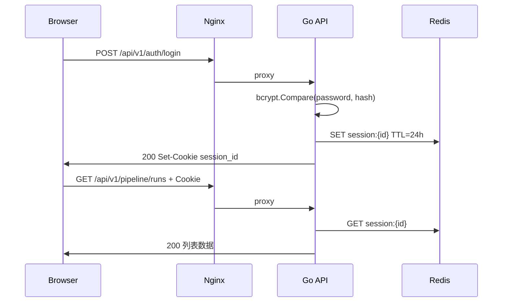
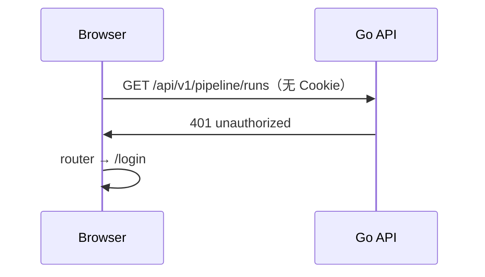

# 08 · 单管理员登录与访问控制

> 文档版本：**v1.0**  
> 最后更新：2026-06-05  
> 状态：**已定稿（实施基准）**  
> 关联：[02-technical-architecture.md](./02-technical-architecture.md) · [06-frontend-standards.md](./06-frontend-standards.md) · [04-operations-runbook.md](./04-operations-runbook.md)

---

## 1. 背景与目标

### 1.1 问题陈述

当前生产环境满足：

- 管理页 `https://yibinfeng.com/` 对公网可访问；
- 管理 API 通过 `X-API-Key` 校验，但 Key 经 `VITE_API_KEY` **打包进前端 JS**；
- 任意访客可在浏览器开发者工具中拿到 Key，等同 **无有效访问控制**。

### 1.2 设计目标

| 目标 | 说明 |
|------|------|
| **单管理员登录** | 仅 1 个固定账号（本人），不开放注册 |
| **浏览器侧零密钥** | 前端 bundle 不含 API Key / 密码 |
| **会话可撤销** | 登出、过期、改密后可失效 |
| **最小改动面** | 复用 Redis；不引入 OAuth / 多租户 |
| **公开页不受影响** | 微信读者侧来源汇总页保持匿名可读 |

### 1.3 非目标（本阶段不做）

- 开放注册、邮箱验证、忘记密码邮件
- 微信 / GitHub OAuth 登录
- 多角色 RBAC（`viewer` / `editor` 等）
- 用户自助改密 UI（首版改密走运维命令）
- JWT 存 `localStorage`（避免 XSS 窃取长期令牌）

---

## 2. 方案选型

### 2.1 选定方案：Redis Session + HttpOnly Cookie

```
浏览器 ──HTTPS──► Nginx ──► Go API
                    │           │
                    │           ├── POST /auth/login（校验 bcrypt）
                    │           ├── Set-Cookie: session_id（HttpOnly, Secure, SameSite=Lax）
                    │           └── 后续请求 Cookie ──► Redis session:{id} ──► admin
```

| 对比项 | 静态 X-API-Key（现状） | Nginx Basic Auth | **Session + Cookie（选定）** |
|--------|------------------------|------------------|------------------------------|
| 前端是否藏得住 | ❌ 暴露在 JS | ✅ | ✅ |
| 登录体验 | 无 | 浏览器原生弹窗 | 自定义登录页 |
| 登出 / 过期 | ❌ | 弱 | ✅ |
| 与现有 SPA 契合 | 中 | 差 | ✅ |
| 实现成本 | 已有 | 极低 | 中（1–2 天） |

### 2.2 凭证分工（双轨，互不替代）

| 凭证类型 | 用途 | 存储位置 |
|----------|------|----------|
| **Session Cookie** | 浏览器访问管理台 | HttpOnly Cookie，Redis 存会话 |
| **ADMIN_API_KEY**（保留） | 脚本、CI、本机 curl 调 API | 仅服务器 `.env`，**禁止**进前端 |

生产环境：`ADMIN_API_KEY` 仍必填；管理 API 中间件改为 **Session 或 API Key 二选一通过**（见 §5.3）。

---

## 3. 威胁模型与安全基线

### 3.1 主要威胁

| 威胁 | 现状 | 目标态 |
|------|------|--------|
| 陌生人打开管理页并操作 | 可能 | 需登录 |
| 从 JS 源码窃取 Key | 可能 | 不可行 |
| 暴力猜密码 | N/A | 登录限流 + 通用错误文案 |
| 会话劫持（XSS） | Cookie 无 HttpOnly 时高风险 | HttpOnly + 短 TTL |
| 会话劫持（窃听） | HTTP 下高风险 | **强制 HTTPS** |

### 3.2 安全基线（强制）

1. **生产必须 HTTPS**（`Secure` Cookie 依赖 TLS）
2. Session ID 使用 **加密安全随机**（≥128 bit，URL-safe Base64）
3. 密码仅存 **bcrypt hash**（cost ≥ 10），禁止明文入库或进 Git
4. 登录失败统一返回 `401` + 文案「用户名或密码错误」（不区分用户是否存在）
5. CORS 生产环境 **禁止 `*`**，须配置明确 `Allow-Origin` + `Allow-Credentials`
6. 登录接口 **限流**：同一 IP 5 次/分钟（Redis 计数）

---

## 4. 配置与账号生命周期

### 4.1 环境变量

```bash
# ─── Session ───
SESSION_COOKIE_NAME=session_id
SESSION_TTL=24h
SESSION_SECURE=true          # production 必须为 true
SESSION_SAME_SITE=Lax

# ─── CORS（production）───
CORS_ALLOWED_ORIGINS=https://yibinfeng.com,https://www.yibinfeng.com

# ─── 机器调用（保留）───
ADMIN_API_KEY=<强随机串>
```

**密码不进 `.env`**，只存 `admin_users.password_hash`。

### 4.2 创建首个管理员（一次性）

表为空时，在能连上 MySQL 的环境执行（勿将密码写入仓库）：

```bash
cd backend
go run ./cmd/createadmin -username admin -password '你的强密码'
```

服务器（Docker）示例：

```bash
cd ~/auto_wechat_tech_content
sudo docker compose -f docker-compose.dev.yml run --rm api \
  go run ./cmd/createadmin -username admin -password '你的强密码'
```

### 4.3 改密流程（首版）

1. `go run ./cmd/hashpassword '新密码'` 得到 bcrypt 哈希  
2. `UPDATE admin_users SET password_hash='...' WHERE username='admin';`  
3. （可选）清理 Redis `session:*`，强制重新登录  

---

## 5. 后端设计

### 5.1 模块结构

```
backend/
├── internal/
│   ├── application/
│   │   └── auth_service.go          # Login、Logout、ValidateSession
│   ├── domain/
│   │   └── session.go               # Session、AdminUser 值对象
│   ├── infrastructure/redis/
│   │   └── session_store.go         # Get / Set / Delete / TTL
│   └── interface/http/
│       ├── handler/auth.go            # Login / Logout / Me
│       ├── middleware/
│       │   ├── session_auth.go        # Cookie → Redis → context
│       │   ├── api_key_or_session.go  # API Key 或 Session 二选一
│       │   ├── cors.go                # 改造：支持 Credentials + 白名单
│       │   └── login_rate_limit.go    # 登录限流
│       └── dto/auth.go
```

### 5.2 Redis 会话结构

**Key：** `session:{sessionId}`  
**TTL：** `SESSION_TTL`（默认 24h，每次请求可选滑动续期）  
**Value（JSON）：**

```json
{
  "userId": "admin",
  "username": "admin",
  "role": "admin",
  "createdAt": "2026-06-05T08:00:00Z",
  "expiresAt": "2026-06-06T08:00:00Z"
}
```

**登出：** `DEL session:{sessionId}`  
**改密后全局失效（可选增强）：** 维护 `admin:session_version`，会话内带 version，改密时递增。

### 5.3 认证中间件语义

```go
// 伪代码 — api_key_or_session.go
func APIKeyOrSessionAuth(adminKey string, sessions SessionStore) gin.HandlerFunc {
    return func(c *gin.Context) {
        // 1) 机器调用：X-API-Key 匹配则放行
        if key := c.GetHeader("X-API-Key"); key != "" && key == adminKey {
            c.Set("auth_method", "api_key")
            c.Next()
            return
        }
        // 2) 浏览器：校验 session cookie
        if sess, ok := sessions.FromCookie(c); ok {
            c.Set("auth_user", sess.Username)
            c.Set("auth_method", "session")
            c.Next()
            return
        }
        response.Error(c, 401, 40100, "unauthorized")
        c.Abort()
    }
}
```

**Context 约定：**

| Key | 类型 | 说明 |
|-----|------|------|
| `auth_user` | string | 当前用户名，如 `admin` |
| `auth_method` | string | `session` \| `api_key` |

### 5.4 路由表

#### 公开（无需认证）

| 方法 | 路径 | 说明 |
|------|------|------|
| GET | `/api/v1/health` | 存活探针 |
| GET | `/api/v1/health/ready` | 就绪探针（可保持公开或仅内网，见运维） |
| GET | `/api/v1/public/runs/:id/sources` | 读者侧来源 HTML，**永久公开** |
| POST | `/api/v1/auth/login` | 登录 |
| POST | `/api/v1/auth/logout` | 登出（无 Cookie 时幂等返回 200） |

#### 需认证（Session 或 API Key）

原 `protected` 组全部移入，**路由路径不变**：

- `/api/v1/pipeline/*`
- `/api/v1/sources`
- `/api/v1/read-source-presets/*`

#### 新增

| 方法 | 路径 | 说明 |
|------|------|------|
| GET | `/api/v1/auth/me` | 当前登录用户（SPA 启动时拉取） |

### 5.5 API 契约

#### POST `/api/v1/auth/login`

**Request:**

```json
{
  "username": "admin",
  "password": "plain-text-password"
}
```

**Response 200:**

```json
{
  "code": 0,
  "message": "ok",
  "data": {
    "username": "admin",
    "role": "admin"
  }
}
```

**Response Headers:**

```
Set-Cookie: session_id=<random>; Path=/; HttpOnly; Secure; SameSite=Lax; Max-Age=86400
```

**Response 401:**

```json
{
  "code": 40101,
  "message": "用户名或密码错误"
}
```

**Response 429:**

```json
{
  "code": 42901,
  "message": "登录尝试过于频繁，请稍后再试"
}
```

#### POST `/api/v1/auth/logout`

- 读取 Cookie → 删除 Redis session → 清除 Cookie（`Max-Age=0`）
- 无 Cookie：仍返回 200（幂等）

#### GET `/api/v1/auth/me`

**Response 200（已登录）:**

```json
{
  "code": 0,
  "message": "ok",
  "data": {
    "username": "admin",
    "role": "admin"
  }
}
```

**Response 401（未登录）:**

```json
{
  "code": 40100,
  "message": "unauthorized"
}
```

### 5.6 错误码段

| code | HTTP | 含义 |
|------|------|------|
| 40100 | 401 | 未登录 / 会话无效 |
| 40101 | 401 | 用户名或密码错误 |
| 42901 | 429 | 登录限流 |

### 5.7 CORS 改造要点

```go
// production 示例
Allow-Origin: https://yibinfeng.com  // 按请求 Origin 白名单匹配，禁止 *
Allow-Credentials: true
Allow-Headers: Origin, Content-Type, Accept, X-API-Key
Allow-Methods: GET, POST, PUT, PATCH, DELETE, OPTIONS
```

`development` 可继续对 `http://localhost:5173` 放行。

---

## 6. 前端设计

### 6.1 原则

- **删除** `VITE_API_KEY` 及 request 中自动附带 `X-API-Key`
- 所有管理 API 请求 `withCredentials: true`（携带 Cookie）
- 未登录访问业务页 → 重定向 `/login?redirect=...`
- 登录页已登录 → 重定向 `/`

### 6.2 新增文件

```
frontend/src/
├── api/auth.ts                 # login / logout / me
├── stores/auth.ts              # Pinia：user、isAuthenticated、fetchMe、login、logout
├── views/LoginView.vue         # 登录表单
├── constants/routes.ts         # + LOGIN
└── router/guards.ts            # beforeEach 鉴权（或写在 router/index.ts）
```

### 6.3 路由

| 路径 | 名称 | 鉴权 | 组件 |
|------|------|------|------|
| `/login` | `LOGIN` | 否 | `LoginView.vue` |
| `/` | `PIPELINE_TRIGGER` | 是 | `PipelineTriggerView.vue` |
| `/runs/:id` | `RUN_DETAIL` | 是 | `RunDetailView.vue` |
| `/runs/:id/preview` | `DRAFT_PREVIEW` | 是 | `DraftPreviewView.vue` |

### 6.4 路由守卫流程

```
beforeEach(to):
  if to.meta.public → next()
  if authStore.isAuthenticated → next()
  try await authStore.fetchMe()
    if ok → next()
  next({ name: LOGIN, query: { redirect: to.fullPath } })
```

`LoginView` 登录成功后 `router.replace(redirect || '/')`。

### 6.5 `request.ts` 改造

```typescript
const client = axios.create({
  baseURL: BASE_URL,
  timeout: 30000,
  withCredentials: true,
  headers: { 'Content-Type': 'application/json' },
})

// 响应拦截：401 → authStore.logout() → router.push('/login')
```

### 6.6 `LoginView.vue` UI 规范

- Element Plus：`el-form` + `el-input`（username、password show-password）
- 提交调用 `authStore.login`
- 错误展示：接口 `message` 或统一「登录失败」
- 不记住密码到 localStorage
- 布局：居中卡片，与现有控制台风格一致（白底、窄屏友好）

### 6.7 环境变量变更

| 变量 | 变更 |
|------|------|
| `VITE_API_KEY` | **删除** |
| `VITE_API_BASE_URL` | 保留，如 `https://yibinfeng.com/api/v1` |

`frontend/.env.example` 同步更新。

### 6.8 App 壳层

`App.vue` 或布局组件增加：

- 已登录：右上角显示 `admin` + 「退出」按钮 → `authStore.logout()`

---

## 7. Nginx / 部署

### 7.1 反代要求

```nginx
location /api/ {
    proxy_pass http://api:8080;
    proxy_set_header Host $host;
    proxy_set_header X-Real-IP $remote_addr;
    proxy_set_header X-Forwarded-For $proxy_add_x_forwarded_for;
    proxy_set_header X-Forwarded-Proto $scheme;
    # Cookie 默认透传，无需额外配置
}
```

### 7.2 不采用 Nginx `auth_basic` 叠加

Session 登录已在应用层完成；避免双重认证造成 Cookie / Basic 冲突。

### 7.3 部署检查清单

- [ ] HTTPS 证书有效（Let's Encrypt 或云证书）
- [ ] `SESSION_SECURE=true`
- [ ] `CORS_ALLOWED_ORIGINS` 含实际域名
- [ ] 防火墙可关闭对外 **8080**（API 仅经 Nginx `/api`）
- [ ] 前端已 `pnpm build` 且不含 `VITE_API_KEY`
- [ ] 轮换已泄露的旧 `ADMIN_API_KEY`（若曾提交 Git）

---

## 8. 数据迁移

**v1.0 已实施 `admin_users` 表**（迁移 `000007_admin_users`）：

```sql
CREATE TABLE admin_users (
    id            CHAR(36) PRIMARY KEY,
    username      VARCHAR(64) NOT NULL UNIQUE,
    password_hash VARCHAR(255) NOT NULL,  -- bcrypt，非明文
    role          VARCHAR(32) NOT NULL DEFAULT 'admin',
    created_at    DATETIME(3) NOT NULL DEFAULT CURRENT_TIMESTAMP(3)
);
```

**首次管理员：** 表为空时执行 `cmd/createadmin` 写入首条记录；登录与改密均以 **DB 为准**，`.env` 不存密码。

---

## 9. 实施分期与任务拆解

### Phase A — 后端（优先）

| # | 任务 | 产出 |
|---|------|------|
| A1 | `session_store.go` + `auth_service.go` | Redis 会话读写 |
| A2 | `handler/auth.go` + `dto/auth.go` | 三个 Auth API |
| A3 | `session_auth.go` + `api_key_or_session.go` | 中间件 |
| A4 | `login_rate_limit.go` | 防暴力 |
| A5 | 改造 `cors.go`、`router.go`、`config.go` | 路由与配置 |
| A6 | 更新 `.env.example` | 文档化新变量 |
| A7 | 单元测试：`auth_service`、中间件 | `go test ./...` |

### Phase B — 前端

| # | 任务 | 产出 |
|---|------|------|
| B1 | `stores/auth.ts` + `api/auth.ts` | 状态与 API |
| B2 | `LoginView.vue` | 登录页 |
| B3 | 路由守卫 + `App.vue` 退出 | 访问控制 |
| B4 | 改造 `request.ts`，移除 `VITE_API_KEY` | 安全 |
| B5 | 更新 `.env.example`、README | 文档 |

### Phase C — 运维与安全

| # | 任务 |
|---|------|
| C1 | 生产执行 `createadmin` 创建管理员 |
| C2 | 轮换 `ADMIN_API_KEY` |
| C3 | 确认 HTTPS + 关 8080 |
| C4 | 验证公开页 ` /public/runs/:id/sources` 仍无需登录 |

**预估工时：** 1.5–2 人日（含联调）。

---

## 10. 测试计划

### 10.1 后端

| 场景 | 期望 |
|------|------|
| 正确用户名密码 | 200 + Set-Cookie |
| 错误密码 | 401，code 40101 |
| 无 Cookie 访问 `POST /pipeline/runs` | 401 |
| 有效 Cookie 访问 `POST /pipeline/runs` | 原行为不变 |
| 有效 `X-API-Key` 访问 | 原行为不变（机器调用） |
| 登出后再访问 | 401 |
| 连续 6 次错误登录 | 第 6 次 429 |
| `GET /public/runs/:id/sources` | 无需 Cookie，200 |

### 10.2 前端

| 场景 | 期望 |
|------|------|
| 未登录打开 `/` | 跳转 `/login` |
| 登录成功 | 进入 `/`，后续 API 正常 |
| 会话过期 | 自动跳转登录页 |
| 点击退出 | Cookie 清除，回登录页 |
| 构建产物 | `grep -r VITE_API_KEY dist/` 无匹配 |

### 10.3 手工回归

- 完整跑一条 Pipeline → 微信草稿箱成功
- 微信读者页「阅读原文」链接仍可打开

---

## 11. 与现有文档的衔接

| 文档 | 需同步章节（实施时） |
|------|----------------------|
| `02-technical-architecture.md` | 安全架构、API 鉴权小节 |
| `06-frontend-standards.md` | 删除 VITE_API_KEY 相关条目 |
| `04-operations-runbook.md` | 改密、会话清理、部署检查 |
| `.env.example` | Session / CORS 等（不含密码） |

---

## 12. 附录：序列图

### 12.1 登录



### 12.2 未登录访问



---

## 13. 决策记录（ADR 摘要）

| 决策 | 理由 |
|------|------|
| Session 存 Redis 而非 JWT | 可即时撤销；单机 Redis 已有；无需处理 JWT 泄露长效问题 |
| Cookie 而非 Authorization Bearer | 浏览器 SPA 最简；HttpOnly 防 XSS 读 token |
| 保留 API Key 双轨 | 兼容脚本运维，不与浏览器 Session 冲突 |
| 首版无 users 表 | 单管理员场景；减迁移与实施面 |
| 登录页不嵌 API Key | 彻底解决前端泄密 |

---

**实施确认：** 本文档为 v1.0 基准。开发按 §9 Phase A → B → C 顺序落地；完成后将 `02`、`06`、`04` 交叉引用更新为 v1.1。
